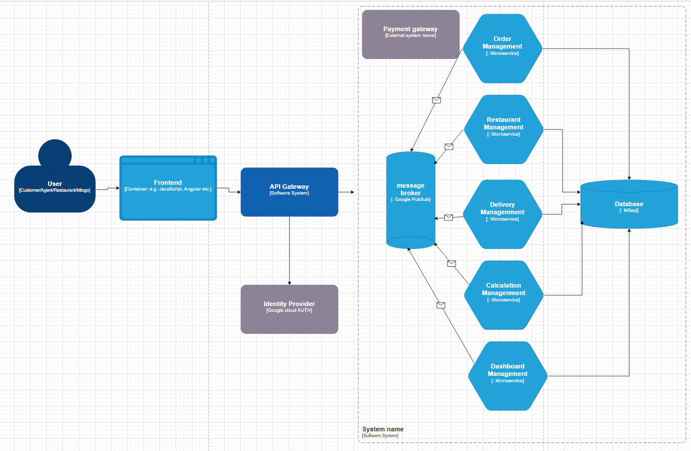
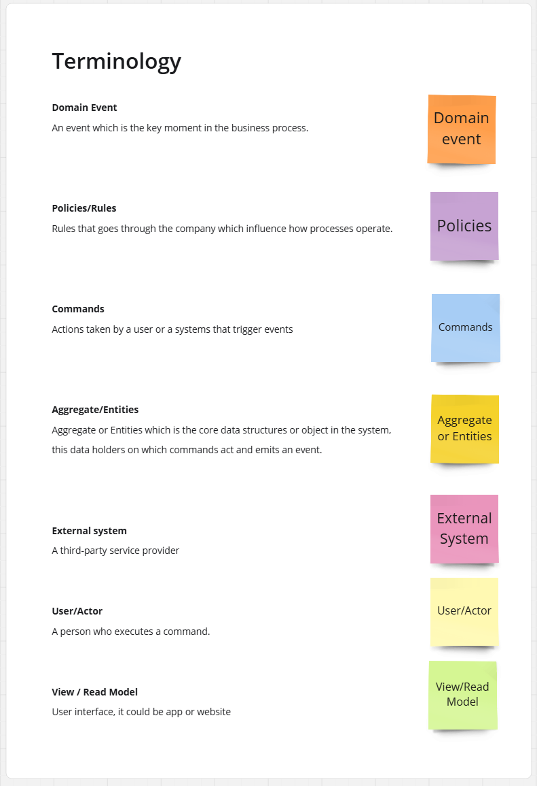
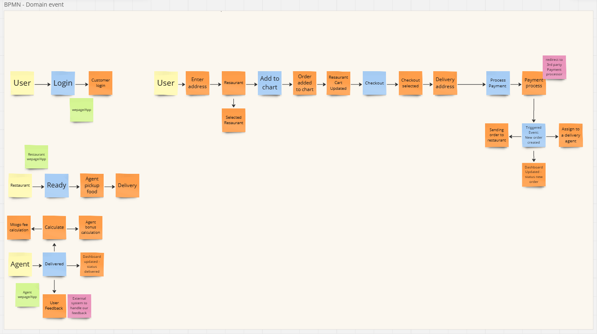

# MTOGO - Integrated Software Solution

## 🚀 **Introduktion**
MTOGO er en moderne, skalerbar softwareløsning til madlevering, designet til at automatisere centrale forretningsprocesser og forbedre kundeoplevelsen. Systemet understøtter flersproget funktionalitet (engelsk og dansk) og fokuserer på:
- Effektiv **Ordrestyring**
- Optimeret **Leveringslogistik**
- Automatiseret **Bonusberegning** for medarbejdere

Systemet inkluderer realtidsopdateringer til kunder og et handlingsorienteret dashboard til ledelsen. Løsningen er baseret på **Domain-Driven Design (DDD)** og en **mikroservices-arkitektur**, som sikrer modularitet, vedligeholdelse og skalerbarhed.

---

## 🛠 **Arkitektur**
- **Domain-Driven Design (DDD):** Fokus på kerneforretningsområder som Ordrestyring og Leveringsstyring.
- **Event Storming:** Bruges til at kortlægge workflows og identificere kernebegivenheder.
- **Mikroservices:** Modularitet sikrer skalerbarhed og enkel vedligeholdelse.
- **Ubiquitous Language:** Konsistens og fælles forståelse gennem klare definitioner som *Order Created* og *Order Delivered*.

### 🧰 **Værktøjer og Teknologier**
- **Docker:** Containerisering for ensartet udviklings- og produktionsmiljø.
- **Kubernetes:** Orkestrering for effektiv administration og skalerbarhed.
- **Google Cloud Pub/Sub:** Asynkron kommunikation mellem mikroservices.
- **Terraform:** Infrastructure as Code (IaC) til nem opsætning og styring af infrastrukturen.
- **CI/CD:** Automatisering af build, test og deployment.
- **Prometheus & Grafana:** Overvågning og visualisering af performance.

---

## 🛠 **Opsætning**
### For at komme i gang:
1. Klon repository: `git clone [repo-url]`
2. Installer Docker og Kubernetes: Følg vejledningen her: [link]
3. Start projektet: `docker-compose up`

### **Onboarding Guide for Nye Medarbejdere**
Denne guide hjælper nye teammedlemmer med hurtigt at forstå og bidrage til projektet:

1. **Introduktion**:
   - Læs projektets formål og arkitektur i denne README.
2. **Opsætning**:
   - Følg installationsvejledningen ovenfor for at opsætte dit miljø.
3. **Arbejdsgange**:
   - Arbejd direkte på main-branchen og brug pair programming til realtidskodegennemgang.
   - Opret issues og tasks i GitHub for at holde styr på opgaver.
4. **Kontaktpersoner**:
   - Ved spørgsmål, kontakt [Navn på kontaktperson].

---

## 🔄 **CI/CD Workflow**
1. **Automatiserede Builds og Tests:**  
   - Sikrer, at hver ny kodeændring testes og bygges automatisk.
2. **Deployment:**  
   - Koden deployeres automatisk til staging og produktionsmiljøer ved hjælp af CI/CD pipelines.
3. **Overvågning:**  
   - Prometheus og Grafana hjælper med performance og fejldetektion.

---

## 🤔 **Udfordringer og Erfaringer**
- **Tidsbegrænsninger:** Vi prioriterede kernefunktionalitet frem for avancerede funktioner.  
- **Kompleksitet:** Teknologier som Kubernetes og Terraform kræver indledende opsætning, men leverede høj skalerbarhed.  
- **Læring:** Selvom vores Prometheus-opsætning var simpel, gav det os vigtig indsigt i overvågning.  

---

## ✅ **Konklusion**
MTOGO demonstrerer en fremtidssikret og skalerbar arkitektur med fokus på:
- **Domain-Driven Design** og **Event-drevne mikroservices**.  
- **CI/CD pipelines** for automatiseret levering.  
- **Agile metoder** som XP og Kanban.

Denne løsning er ikke kun en funktionel prototype, men også et grundlag for fremtidig vækst og optimering.

---

## 📂 **Bilag**
1. **Contain Diagram**
   - 
2. **High View Diagram**
   - (Upload mangler link)
3. **Event Storming Terminology**
   - 
4. **Event Storming Workflows**
   - 

---

## 👥 **Team**
- [Jamal Ahmed]  
- [Mohamed Salim]  

---

## 📧 **Kontakt**
- [Email-adresse]

